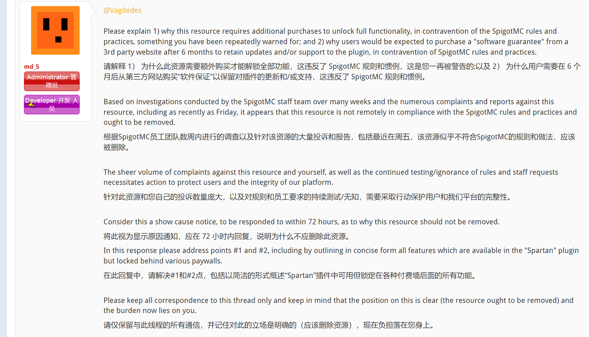
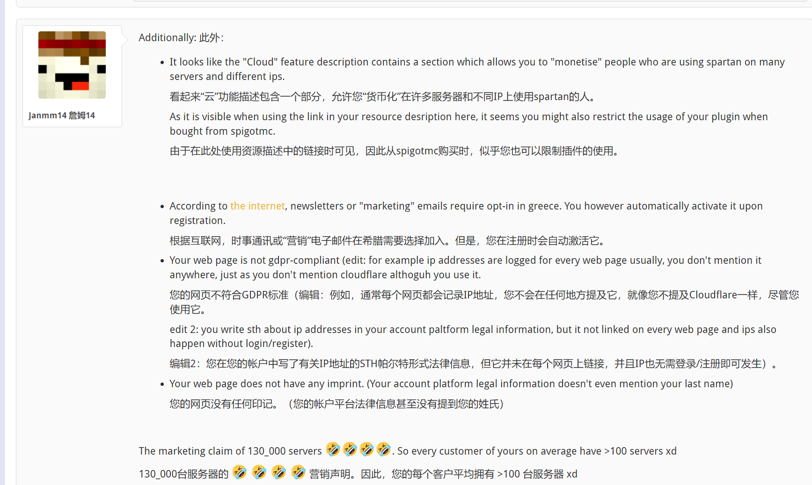
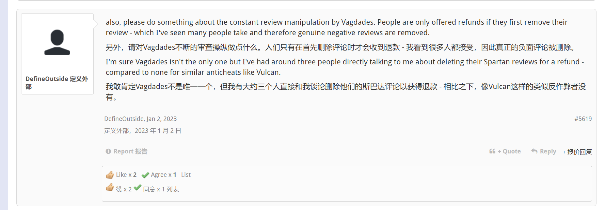
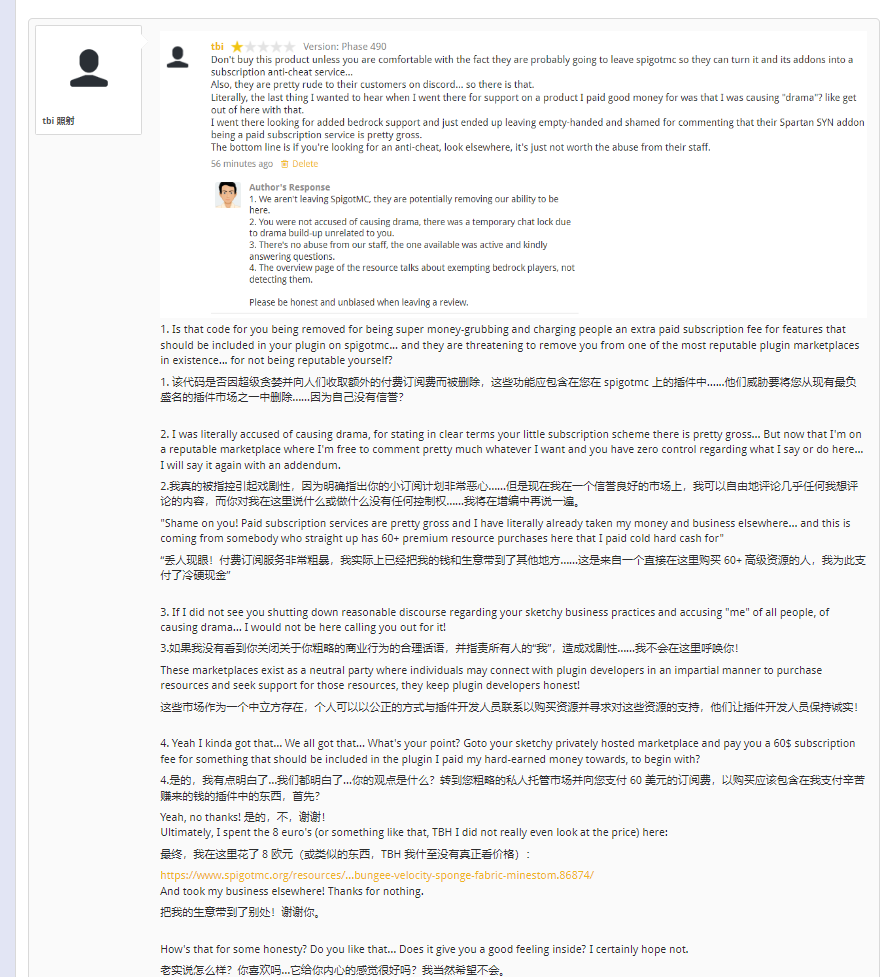
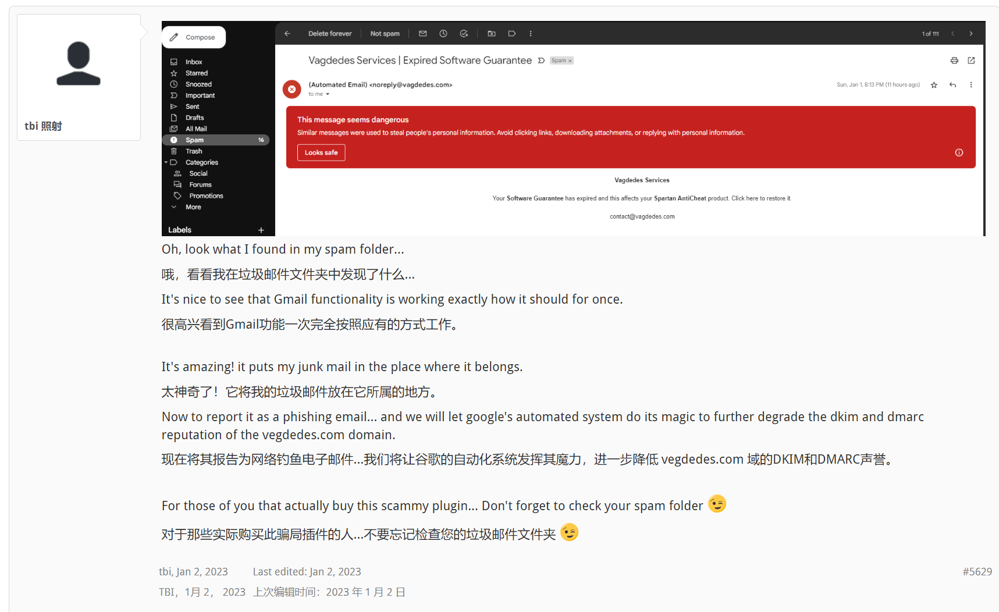
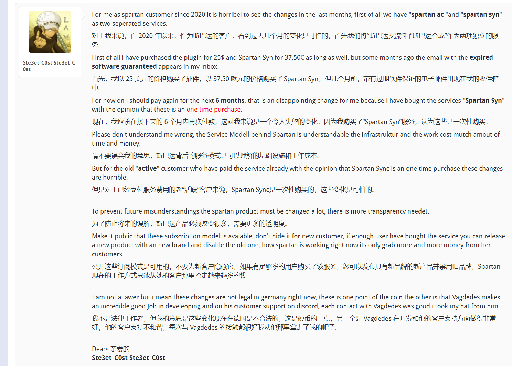
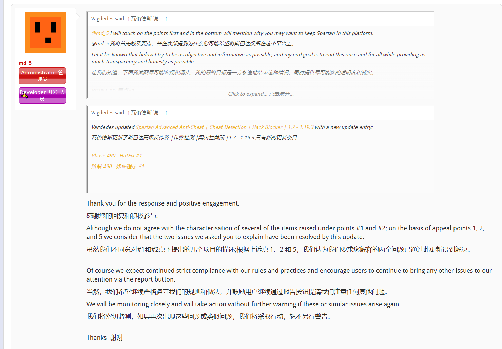
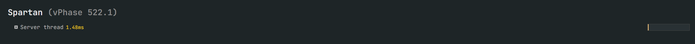
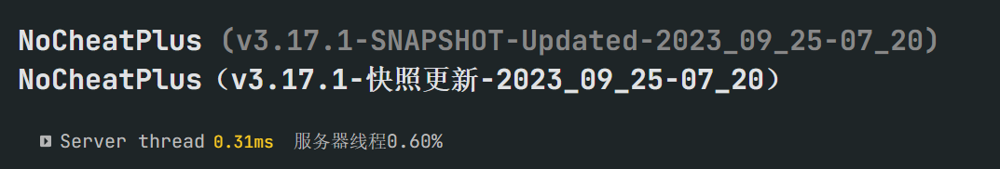

## 什么是Spartan AntiCheat
#### Spartan是一款老牌反作弊，他在于自动阻止你服务器上的作弊玩家，并且*高性能*，且兼容*Geyser*，从上线以来在SpigotMC颇受欢迎，可以说是好评最多的反作弊之一

---

## 好评截至

#### 但这样的状态在2023年1月因为Spartan Syn 事件打破了，尽管这事已经在SpigotMC上被md_5（SpigotMC-DEV）警告并做了改正，但热度很少，很多人还不知道这件事情，所以我将这件事重新揭露出来，请查看Spartan反作弊的丑恶一面。

---

## 1.首先，从警告开始

#### md_5质问为什么购买Spartan的人6个月后，仍然需要到第三方网站内，付费购买所谓的“软件保证”才能继续使用Spartan的完整检测？

## 2.虚假营销数据

#### 这里被爆出Spartan的虚假营销，您Spartan的130_000台服务器的营销数据，是不是说明了您的用户人均>100台服务器

## 3.如同抖音的一流控评技术

#### 您购买Spartan后如遇到问题需要退款，请先删除你客观的负面评论，不要影响我辛辛苦苦刷的SpigotMC好评

## 4.不允许你说Spartan的任何坏话

#### 吐槽Spartan的垃圾订阅模式惨遭威胁

## 5.Spartan的邮箱已被Google标记垃圾邮件

#### 希望Spartan早日死去

## 6.2020年的Spartan用户对目前Spartan的评价

#### 首先我花费了25€购买了插件，后续花费了37.5€的价格购买了Spartan Syn，但是在几个月后我又收到了Spartan的订阅过期邮件，要求我继续为Spartan的服务续费，这是老用户感到伤心的，尽管Spartan的支持很好，每次都能优先解决用户问题，但是收费模式令人心寒，不仅仅是老用户，更是新用户

## 7.最后知错就改

#### Spartan syn现在免费提供给所有Spartan用户，这就是故事的终章了

---
## 可能你觉得，Spartan也没做错什么，只不过是做了个第三方额外收费项目

#### 那么我现在告诉你，当你知道购买此插件后获得垃圾的检测和最糟糕的性能，你将还会这样想吗，Spartan是目前占用最高、检测最拉跨、最误判多的一款Minecraft反作弊

## 来自SparkMC性能测试 

### (全部非严谨测试，同配置3-5人占用)

#### 仅供粗略参考，如果你有问题，欢迎携带严谨的测试数据殴打我

#### 其他反作弊测试

---

## 最后，请您避免使用Spartan反作弊

#### 你可能觉得我是为了黑Spartan而黑它，不论你怎么想都是对的，因为我只是把发生的事展现出来，剩下的由您自己决定。

原帖连接https://www.spigotmc.org/threads/spartan-advanced-anti-cheat-cheat-detection-hack-blocker.162759/page-283

使用你的小手往上翻翻就找到了本篇所有出现过的言论