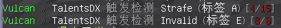
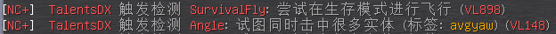
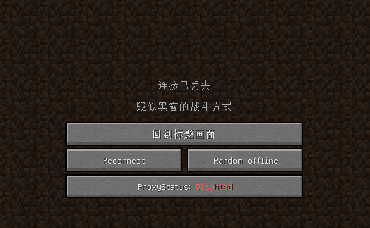
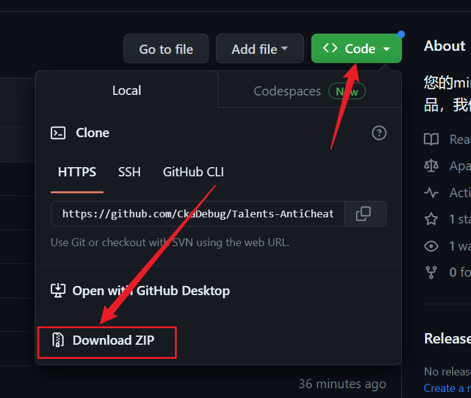
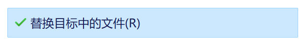

> [!WARNING]
> The new configuration has not been extensively tested，
> If you have any questions, please create issues

# ⚠️前言 ⚠️ 
不要对此配置进行**发布**或**出售**并声称是你的**原创**配置

>
> 本配置是 **免费制作**
> 用来替换那些付费反作弊配置
>
> ---
>
> 您需要使用最新的Dev版[Protocollib](https://github.com/dmulloy2/ProtocolLib)来使用本配置(不然可能造成些许错误)
>

---

 ## 🛡人才反作弊配置🛡

### 尝试针对多种反作弊在各种玩法的服务器上进行 **优化** 的配置

###  ~出自2017-2024的作弊端用户之手~

### **“往 往 招 牌 都 被 自 己 砸 手 里”**

##### MineBBS介绍页:[点击转跳](https://www.minebbs.com/resources/talents-anticheat-config.7557/)

---

✨特点✨

- 针对不同玩法服务器定制
- 近乎本土化的警报消息
- 提升反作弊检测速度
- 减少反作弊误判
- 独特的参数调配
- 完全Free

#### *别把我和那些垃圾付费配置归类*

#### *他们随便调点东西就是为了利益*

#### *而我只想做你们伟大征程的一块积木*

---

###  **📷预览📷**
- 语言修改 *（改进反作弊的消息提示）*

---

### **⭐我在调整的反作弊插件列表⭐**
*包含（过时配置）文件的不会进行任何问题处理，因为反作弊插件早已被作者抛弃*

- [Matrix](https://matrix.rip)
- [NocheatPlus](https://github.com/Updated-NoCheatPlus/NoCheatPlus)
- [GrimAC](https://github.com/GrimAnticheat/Grim)
- [LightningGrimAC](https://modrinth.com/plugin/lightning-grim-anticheat)
- [Vulcan](https://www.spigotmc.org/resources/vulcan-anti-cheat-advanced-cheat-detection-1-7-1-19.83626/)
- [Themis](https://www.spigotmc.org/resources/themis-anti-cheat-1-17-1-18-1-19-bedrock-support-paper-compatibility-free-optimized.90766/)
- [Hawk](https://github.com/HawkAnticheat/Hawk)
- [LightAntiCheat](https://www.spigotmc.org/resources/lightanticheat-1-8-1-20-6-geyser-folia-support.112053/updates)
- [AAC](https://www.spigotmc.org/resources/aac-advanced-anti-cheat-hack-kill-aura-blocker.6442)
- [TakaAC](https://www.spigotmc.org/resources/taka-anticheat-takaac-cheap-and-reliable-solution.45167/)
- [Spartan](https://www.spigotmc.org/resources/spartan-advanced-anti-cheat-cheat-detection-hack-blocker-1-7-1-19-2-10-summer-sale.25638) 💀[一些猛料](https://github.com/TalentsRC/Talents-anticheat-config/blob/main/.github/fucking-spartan.md)💀

---

### 🔧如何使用🔧

#### 1.把配置下载到本地

####  2.替换掉原先反作弊的配置(yml)文件。

####  3.重新启动你的服务器。

#### 4.享受反作弊！

---

 💗我参考以及直接使用的配置💗

### 如果 *没有* 这些反作弊做参考，本项目也不会伟大，感谢这些配置作者！

- [Winds-anticheat-config](https://github.com/Winds-Studio/winds-anticheat-config) (R.I.P)

- [Flex-AntiCheat](https://github.com/ItsMennyo/Flex-AntiCheat)(R.I.P)

- [MatrixChecks](https://github.com/Encode42/MatrixChecks)(R.I.P)

- TAC v1/v2/v3/v4(R.I.P)

- Matrix7Checks(R.I.P)

---

## 🎶稍等一下🎶

### 在离开之前，请先看看其他的优秀项目!!

⠀
⠀

<h5>Leaf是一款来自国人Dreeam-qwq对 <a href="https://github.com/GaleMC/Gale">Gale</a> 进行fork的服务器核心版本，它删除了一些原版的检测并添加了可能最好的优化补丁，是目前最有潜力的优化服务器核心</h5>
<h8>Logo图标来自 <a href="https://github.com/envizar">envizar</a></h8>

---
